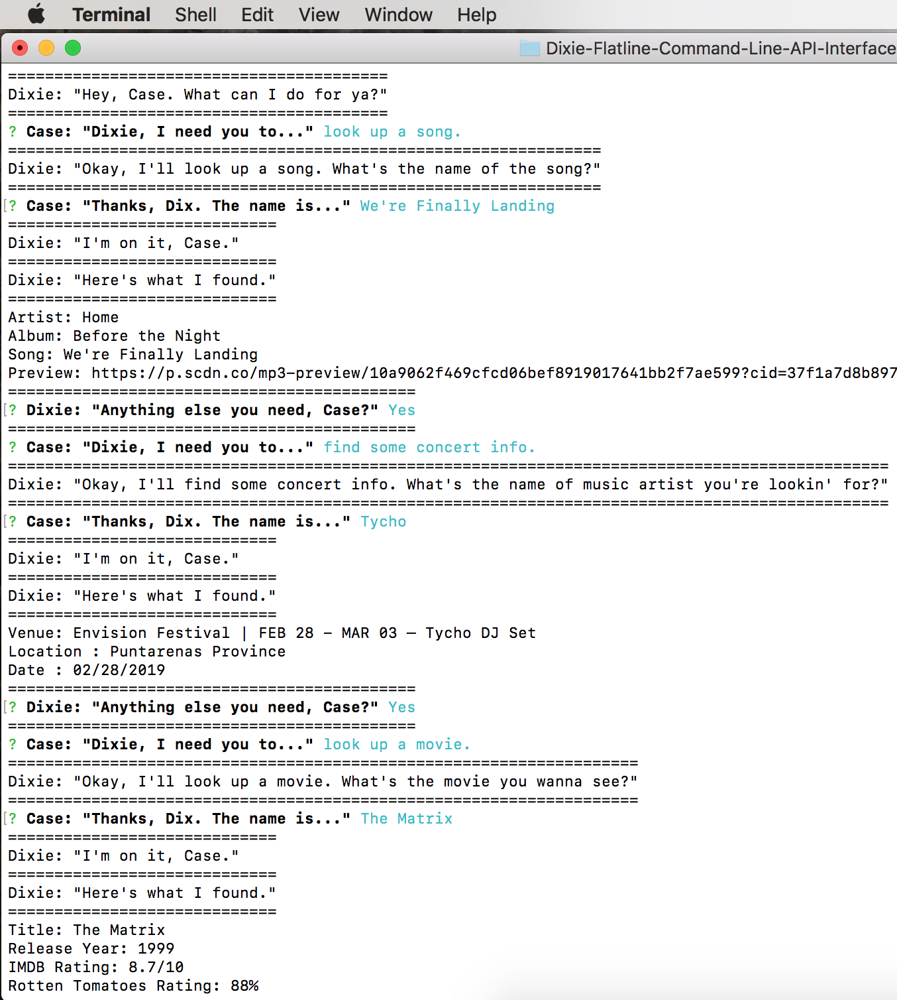

# Dixie Flatline Command Line Interface

 

#### About the App: 

Dixie Flatline Command Line Interface is a Terminal app themed after William Gibson's cyberpunk novel, Neuromancer. User's can ask the 'Dixie Flatline construct' to look up information on songs, concert events, and movies by following Dixie's prompts and providing keywords for the searches Dixie performs.

<hr>

## Getting Started / Prerequisites

To use the Dixie Flatline CLI, you will need to install the following NPM packages:
* Request
* Node-Spotify-API
* Inquirer
* Moment
* Dotenv

You will also need your own API keys to the Spotify, Bands in Town, and OMDB APIs.

<hr>

## Installing

If you downloaded the app's package.json file, run the following command once from the app's directory in Terminal:

```
$ npm install
```

If you did not download the app's package.json file, run the following command for each of the NPM packages listed above:

```
$ npm install <package name>
```

<hr>

## Built With

* [`Javascript`](https://developer.mozilla.org/en-US/docs/Web/JavaScript)

* [`NPM Packages`](https://www.npmjs.com/)
    1. [Request](https://www.npmjs.com/package/request)
    2. [Node-Spotify-API](https://www.npmjs.com/package/node-spotify-api)
    3. [Inquirer](https://www.npmjs.com/package/inquirer)
    4. [Moment](https://www.npmjs.com/package/moment)
    5. [Dotenv](https://www.npmjs.com/package/dotenv)

<hr>

## Authors

* **Jacob Moore** - [Dixie Flatline Command Line Interface](https://github.com/jrmoore117/Dixie-Flatline-Command-Line-API-Interface)